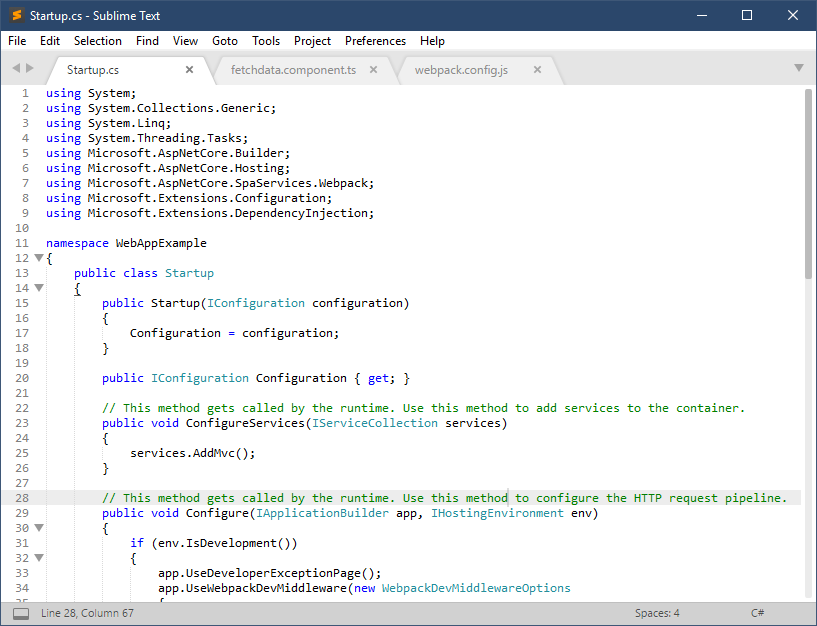
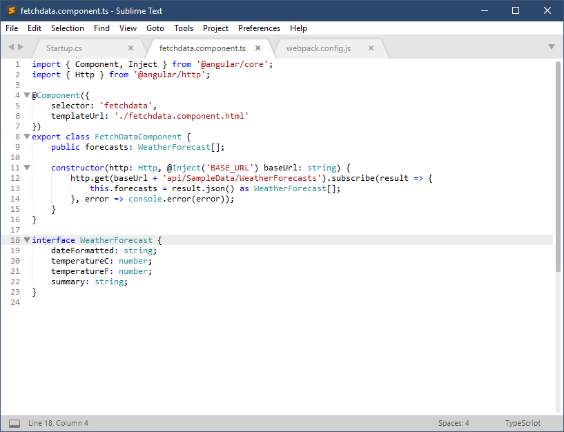
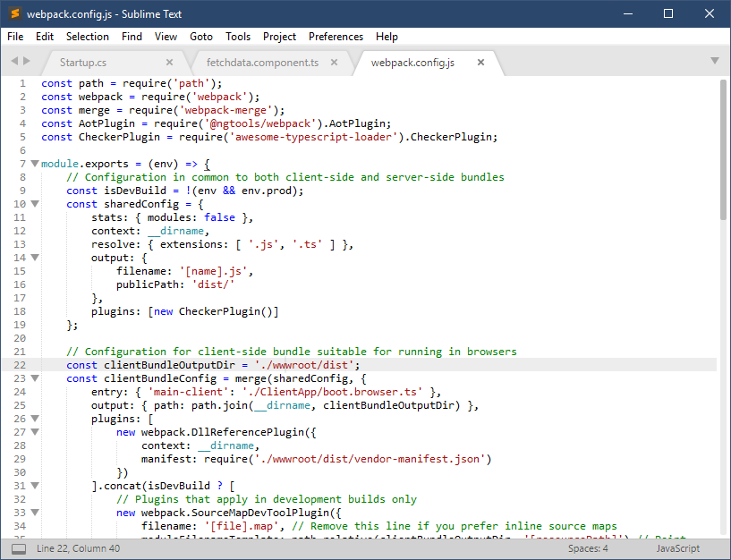

## Visual Studio Light Colour Scheme for Sublime Text 3

Based on [this scheme](https://github.com/mihaifm/Visual-Studio.tmTheme) with enhanced highlighting for C#, TypeScript and Markdown.

### Installation

1. Open `Preferences -> Browse Packages`.
2. Create a folder.
3. Drop the `VisualStudioLight.tmTheme` file into the folder.

### Screenshots 

#### C#

#### TypeScript

#### JavaScript
